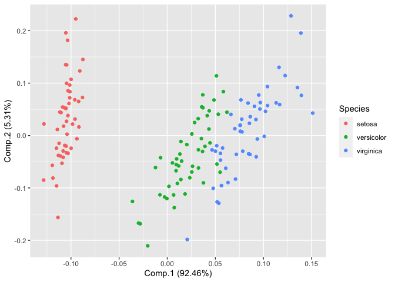
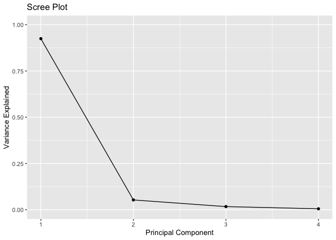
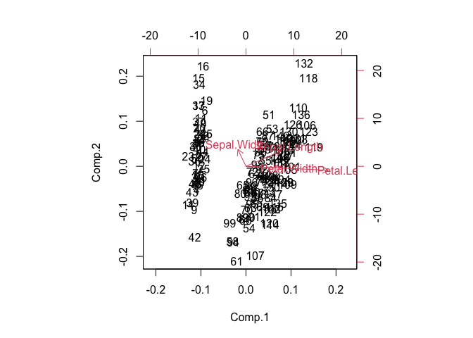

TASK 10: Dimensionality reduction and Clustering I
================
Tami
2022-09-01

-   [R Markdown](#r-markdown)

## R Markdown

``` r
##TASK 10. Dimensionality reduction and clustering I
##Load the iris dataset
library(tidyverse)
```

    ## ── Attaching packages ─────────────────────────────────────── tidyverse 1.3.1 ──

    ## ✓ ggplot2 3.3.5     ✓ purrr   0.3.4
    ## ✓ tibble  3.1.6     ✓ dplyr   1.0.9
    ## ✓ tidyr   1.2.0     ✓ stringr 1.4.0
    ## ✓ readr   2.1.2     ✓ forcats 0.5.1

    ## ── Conflicts ────────────────────────────────────────── tidyverse_conflicts() ──
    ## x dplyr::filter() masks stats::filter()
    ## x dplyr::lag()    masks stats::lag()

``` r
library(dplyr)
data(iris)
```

``` r
##Convert iris data into unlabelled dataset
df<- iris
dfIris<- select(df, -Species)
```

``` r
##Check the PCA eligibility
cor(dfIris)
```

    ##              Sepal.Length Sepal.Width Petal.Length Petal.Width
    ## Sepal.Length    1.0000000  -0.1175698    0.8717538   0.8179411
    ## Sepal.Width    -0.1175698   1.0000000   -0.4284401  -0.3661259
    ## Petal.Length    0.8717538  -0.4284401    1.0000000   0.9628654
    ## Petal.Width     0.8179411  -0.3661259    0.9628654   1.0000000

``` r
mean(cor(dfIris))
```

    ## [1] 0.4675531

``` r
#The variables are eligible for PCA
```

\##Formulate two questions or hypotheses on the data, that you want to
answer by using a PCA \#1. Check whether the PCs capture the essence of
the original variable \#2. Check whether the PCs are independent

``` r
##Now, let's run PCA
PCA<- princomp(dfIris)
```

``` r
##Inspect the loadings with the PCA object
PCA$loadings
```

    ## 
    ## Loadings:
    ##              Comp.1 Comp.2 Comp.3 Comp.4
    ## Sepal.Length  0.361  0.657  0.582  0.315
    ## Sepal.Width          0.730 -0.598 -0.320
    ## Petal.Length  0.857 -0.173        -0.480
    ## Petal.Width   0.358        -0.546  0.754
    ## 
    ##                Comp.1 Comp.2 Comp.3 Comp.4
    ## SS loadings      1.00   1.00   1.00   1.00
    ## Proportion Var   0.25   0.25   0.25   0.25
    ## Cumulative Var   0.25   0.50   0.75   1.00

``` r
##Use the score to check principal components
PCvalues<- PCA$scores
```

``` r
##Check correlation to see whether they are independent
cor(PCvalues)
```

    ##               Comp.1        Comp.2       Comp.3        Comp.4
    ## Comp.1  1.000000e+00 -1.176943e-15 5.182917e-18 -1.726895e-15
    ## Comp.2 -1.176943e-15  1.000000e+00 1.787545e-15  6.313141e-16
    ## Comp.3  5.182917e-18  1.787545e-15 1.000000e+00  6.047785e-15
    ## Comp.4 -1.726895e-15  6.313141e-16 6.047785e-15  1.000000e+00

\##The correlation is almost zero, therefore, the variables are
independent.

``` r
##Visualize PCA
#install.packages("ggfortify")
library(ggfortify)
```

``` r
PCAplot<- autoplot(PCA, data = iris, colour= 'Species')
PCAplot
```

<!-- -->

``` r
##Explain the variances with a scree plot
library(ggplot2)
```

``` r
##calculate total variance explained by each principal component
var_explained = PCA$sdev^2 / sum(PCA$sdev^2)
```

``` r
##Create a Scree plot
qplot(c(1:4), var_explained) + 
  geom_line() + 
  xlab("Principal Component") + 
  ylab("Variance Explained") +
  ggtitle("Scree Plot") +
  ylim(0, 1)
```

<!-- -->

``` r
##Investigate potential correlations of your PCs 
biplot(PCA)
```

<!-- -->

\##Comment what you can see on them and how you interpret the result

``` r
print(var_explained)
```

    ##      Comp.1      Comp.2      Comp.3      Comp.4 
    ## 0.924618723 0.053066483 0.017102610 0.005212184

\##The first principal component explains 92.46% of the total variation
in the dataset. \##The second principal component explains 5.31% of the
total variation in the dataset. \##The third principal component
explains 1.71% of the total variation in the dataset. \##The first
principal component explains 0.5% of the total variation in the dataset.
