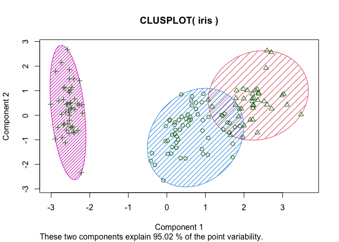
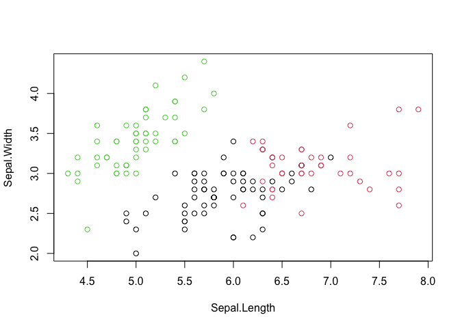

TASK 11: Cluster Analysis
================
Tamryn Baxter
2022-09-01

-   [R Markdown](#r-markdown)

## R Markdown

``` r
##TASK 11. Cluster Analysis
##Using the Iris Dataset
#Load Iris
data("iris")
```

``` r
##Remove "species" column
library(tidyverse)
```

    ## ── Attaching packages ─────────────────────────────────────── tidyverse 1.3.1 ──

    ## ✓ ggplot2 3.3.5     ✓ purrr   0.3.4
    ## ✓ tibble  3.1.6     ✓ dplyr   1.0.9
    ## ✓ tidyr   1.2.0     ✓ stringr 1.4.0
    ## ✓ readr   2.1.2     ✓ forcats 0.5.1

    ## ── Conflicts ────────────────────────────────────────── tidyverse_conflicts() ──
    ## x dplyr::filter() masks stats::filter()
    ## x dplyr::lag()    masks stats::lag()

``` r
library(dplyr)
NewIris<- select(iris, -Species)
```

``` r
##Conduct cluste analysis using 3 clusters
irisCluster<- kmeans(NewIris, centers = 3, nstart = 20)
```

``` r
##We can compare the predicted clusters with the original data.
table(irisCluster$cluster, iris$Species)
```

    ##    
    ##     setosa versicolor virginica
    ##   1      0         48        14
    ##   2      0          2        36
    ##   3     50          0         0

``` r
##Visualize Clusters 
library(cluster)
clusplot(iris, irisCluster$cluster, color = T, shade = T, labels = 0, lines = 0)
```

<!-- -->
\##Notably, setosa cluster perfectly elaborated, while virginica and
versicolor have a little noise between their clusters

``` r
##Some other visual plots
plot(NewIris[c("Sepal.Length", "Sepal.Width")], col= irisCluster$cluster)
```

<!-- -->
