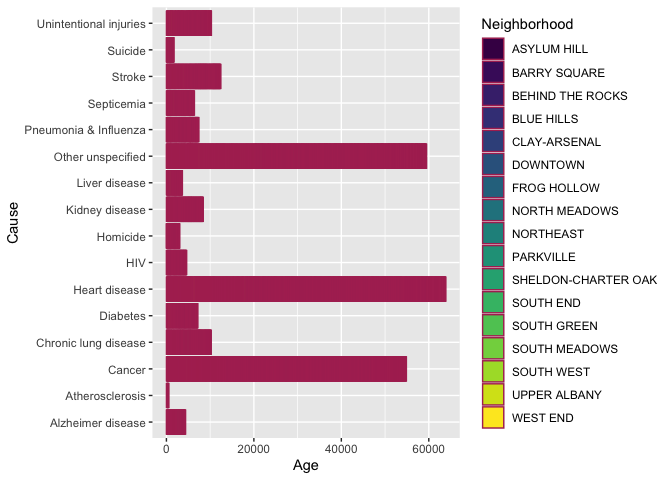

TASK 5: Visualizations
================
Tamryn Baxter
2022-09-01

``` r
##TASK 5.Visualizations I

##Import the dataset
Hartford<- read.csv("HartfordDeathsCleaned.csv")
```

``` r
##Content description
##View the datatypes
str(Hartford)
```

    ## 'data.frame':    3842 obs. of  7 variables:
    ##  $ YearOfDeath : int  2008 2008 2008 2008 2008 2008 2008 2008 2008 2008 ...
    ##  $ Age         : int  63 91 77 64 56 55 94 91 81 93 ...
    ##  $ Gender      : chr  "Male" "Male" "Male" "Male" ...
    ##  $ Identity    : chr  "non-Hispanic White" "non-Hispanic White" "non-Hispanic White" "non-Hispanic White" ...
    ##  $ Cause       : chr  "Cancer" "Cancer" "Cancer" "Other unspecified" ...
    ##  $ Neighborhood: chr  "SOUTH WEST" "SOUTH WEST" "SOUTH WEST" "SOUTH WEST" ...
    ##  $ AgeGroup    : chr  "Adults" "Seniors" "Seniors" "Adults" ...

``` r
##Transform the data from wide into long format
library(reshape2)
DataWide<- melt(Hartford, value= c("Age", "Cause"))
```

    ## Using Gender, Identity, Cause, Neighborhood, AgeGroup as id variables

``` r
##Split the Neighbourhood column into Neighbor and Direction
library(tidyr)
```

    ## 
    ## Attaching package: 'tidyr'

    ## The following object is masked from 'package:reshape2':
    ## 
    ##     smiths

``` r
sepData<- separate(DataWide, col = Neighborhood, into = c("Neighbor", "Direction"), sep = " ")
```

    ## Warning: Expected 2 pieces. Additional pieces discarded in 512 rows [128, 129,
    ## 130, 131, 132, 133, 134, 135, 136, 137, 138, 139, 140, 141, 142, 143, 144, 145,
    ## 146, 147, ...].

    ## Warning: Expected 2 pieces. Missing pieces filled with `NA` in 1628 rows [176,
    ## 177, 178, 179, 180, 181, 182, 183, 184, 185, 186, 187, 188, 189, 190, 191, 192,
    ## 193, 194, 195, ...].

``` r
##Combine columns gender and AgeGroup
CombineData<- unite(Hartford, Gender_Group, Gender, AgeGroup, sep = "/")
```

``` r
##Create a plot using ggplot
library(ggplot2)
Hartford %>% 
  ggplot(aes(x= Age, y= Cause, fill= Neighborhood))+
  geom_bar(stat= "identity", color= "maroon")+
  scale_fill_viridis_d()
```

<!-- -->
