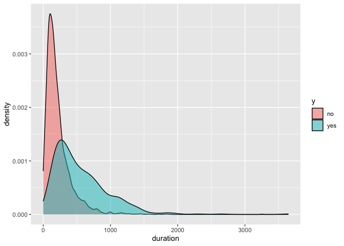

TASK 6. Visualizations
================
Tami
2022-09-01

-   [R Markdown](#r-markdown)

## R Markdown

``` r
##TASK 6. Visualisations II

##Load the dataset
BankData<- read.csv("BankSep.csv")
```

``` r
##Visualize the data
##First, check the no. of observations
dim(BankData)
```

    ## [1] 4119   21

``` r
##Check structure of data
str(BankData)
```

    ## 'data.frame':    4119 obs. of  21 variables:
    ##  $ age           : int  30 39 25 38 47 32 32 41 31 35 ...
    ##  $ job           : chr  "blue-collar" "services" "services" "services" ...
    ##  $ marital       : chr  "married" "single" "married" "married" ...
    ##  $ education     : chr  "basic.9y" "high.school" "high.school" "basic.9y" ...
    ##  $ default       : chr  "no" "no" "no" "no" ...
    ##  $ housing       : chr  "yes" "no" "yes" "unknown" ...
    ##  $ loan          : chr  "no" "no" "no" "unknown" ...
    ##  $ contact       : chr  "cellular" "telephone" "telephone" "telephone" ...
    ##  $ month         : chr  "may" "may" "jun" "jun" ...
    ##  $ day_of_week   : chr  "fri" "fri" "wed" "fri" ...
    ##  $ duration      : int  487 346 227 17 58 128 290 44 68 170 ...
    ##  $ campaign      : int  2 4 1 3 1 3 4 2 1 1 ...
    ##  $ pdays         : int  999 999 999 999 999 999 999 999 999 999 ...
    ##  $ previous      : int  0 0 0 0 0 2 0 0 1 0 ...
    ##  $ poutcome      : chr  "nonexistent" "nonexistent" "nonexistent" "nonexistent" ...
    ##  $ emp.var.rate  : num  -1.8 1.1 1.4 1.4 -0.1 -1.1 -1.1 -0.1 -0.1 1.1 ...
    ##  $ cons.price.idx: num  92.9 94 94.5 94.5 93.2 ...
    ##  $ cons.conf.idx : num  -46.2 -36.4 -41.8 -41.8 -42 -37.5 -37.5 -42 -42 -36.4 ...
    ##  $ euribor3m     : num  1.31 4.86 4.96 4.96 4.19 ...
    ##  $ nr.employed   : num  5099 5191 5228 5228 5196 ...
    ##  $ y             : chr  "no" "no" "no" "no" ...

``` r
##Now, let's visualize the data
##We can create a density plot
library(tidyverse)
```

    ## ── Attaching packages ─────────────────────────────────────── tidyverse 1.3.1 ──

    ## ✓ ggplot2 3.3.5     ✓ purrr   0.3.4
    ## ✓ tibble  3.1.6     ✓ dplyr   1.0.9
    ## ✓ tidyr   1.2.0     ✓ stringr 1.4.0
    ## ✓ readr   2.1.2     ✓ forcats 0.5.1

    ## ── Conflicts ────────────────────────────────────────── tidyverse_conflicts() ──
    ## x dplyr::filter() masks stats::filter()
    ## x dplyr::lag()    masks stats::lag()

``` r
library(dplyr)
BankData %>% 
  ggplot(aes(x= duration, fill= y))+
  geom_density(alpha= 0.5)+
  theme_gray()
```

<!-- -->
