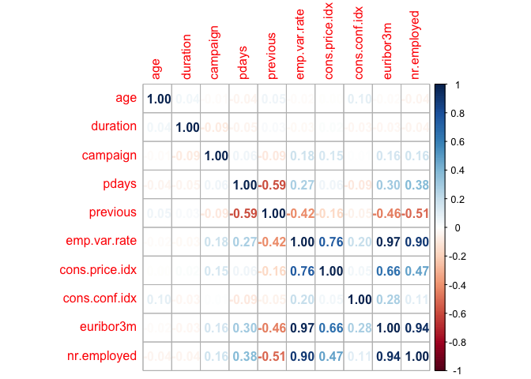
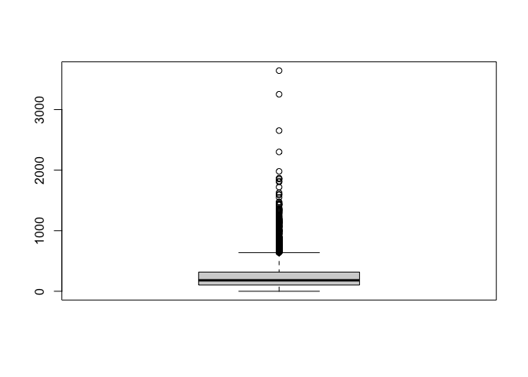

TASK 7: Modelling
================
Tamryn Baxter
2022-09-01

-   [R Markdown](#r-markdown)

## R Markdown

``` r
##TASK 7. Modeling
##Load the dataset
Default<- read.csv("BankSep.csv")
```

``` r
##Describe the data
str(Default)
```

    ## 'data.frame':    4119 obs. of  21 variables:
    ##  $ age           : int  30 39 25 38 47 32 32 41 31 35 ...
    ##  $ job           : chr  "blue-collar" "services" "services" "services" ...
    ##  $ marital       : chr  "married" "single" "married" "married" ...
    ##  $ education     : chr  "basic.9y" "high.school" "high.school" "basic.9y" ...
    ##  $ default       : chr  "no" "no" "no" "no" ...
    ##  $ housing       : chr  "yes" "no" "yes" "unknown" ...
    ##  $ loan          : chr  "no" "no" "no" "unknown" ...
    ##  $ contact       : chr  "cellular" "telephone" "telephone" "telephone" ...
    ##  $ month         : chr  "may" "may" "jun" "jun" ...
    ##  $ day_of_week   : chr  "fri" "fri" "wed" "fri" ...
    ##  $ duration      : int  487 346 227 17 58 128 290 44 68 170 ...
    ##  $ campaign      : int  2 4 1 3 1 3 4 2 1 1 ...
    ##  $ pdays         : int  999 999 999 999 999 999 999 999 999 999 ...
    ##  $ previous      : int  0 0 0 0 0 2 0 0 1 0 ...
    ##  $ poutcome      : chr  "nonexistent" "nonexistent" "nonexistent" "nonexistent" ...
    ##  $ emp.var.rate  : num  -1.8 1.1 1.4 1.4 -0.1 -1.1 -1.1 -0.1 -0.1 1.1 ...
    ##  $ cons.price.idx: num  92.9 94 94.5 94.5 93.2 ...
    ##  $ cons.conf.idx : num  -46.2 -36.4 -41.8 -41.8 -42 -37.5 -37.5 -42 -42 -36.4 ...
    ##  $ euribor3m     : num  1.31 4.86 4.96 4.96 4.19 ...
    ##  $ nr.employed   : num  5099 5191 5228 5228 5196 ...
    ##  $ y             : chr  "no" "no" "no" "no" ...

``` r
##Descriptive statistics
summary(Default)
```

    ##       age            job              marital           education        
    ##  Min.   :18.00   Length:4119        Length:4119        Length:4119       
    ##  1st Qu.:32.00   Class :character   Class :character   Class :character  
    ##  Median :38.00   Mode  :character   Mode  :character   Mode  :character  
    ##  Mean   :40.11                                                           
    ##  3rd Qu.:47.00                                                           
    ##  Max.   :88.00                                                           
    ##    default            housing              loan             contact         
    ##  Length:4119        Length:4119        Length:4119        Length:4119       
    ##  Class :character   Class :character   Class :character   Class :character  
    ##  Mode  :character   Mode  :character   Mode  :character   Mode  :character  
    ##                                                                             
    ##                                                                             
    ##                                                                             
    ##     month           day_of_week           duration         campaign     
    ##  Length:4119        Length:4119        Min.   :   0.0   Min.   : 1.000  
    ##  Class :character   Class :character   1st Qu.: 103.0   1st Qu.: 1.000  
    ##  Mode  :character   Mode  :character   Median : 181.0   Median : 2.000  
    ##                                        Mean   : 256.8   Mean   : 2.537  
    ##                                        3rd Qu.: 317.0   3rd Qu.: 3.000  
    ##                                        Max.   :3643.0   Max.   :35.000  
    ##      pdays          previous        poutcome          emp.var.rate     
    ##  Min.   :  0.0   Min.   :0.0000   Length:4119        Min.   :-3.40000  
    ##  1st Qu.:999.0   1st Qu.:0.0000   Class :character   1st Qu.:-1.80000  
    ##  Median :999.0   Median :0.0000   Mode  :character   Median : 1.10000  
    ##  Mean   :960.4   Mean   :0.1903                      Mean   : 0.08497  
    ##  3rd Qu.:999.0   3rd Qu.:0.0000                      3rd Qu.: 1.40000  
    ##  Max.   :999.0   Max.   :6.0000                      Max.   : 1.40000  
    ##  cons.price.idx  cons.conf.idx     euribor3m      nr.employed  
    ##  Min.   :92.20   Min.   :-50.8   Min.   :0.635   Min.   :4964  
    ##  1st Qu.:93.08   1st Qu.:-42.7   1st Qu.:1.334   1st Qu.:5099  
    ##  Median :93.75   Median :-41.8   Median :4.857   Median :5191  
    ##  Mean   :93.58   Mean   :-40.5   Mean   :3.621   Mean   :5166  
    ##  3rd Qu.:93.99   3rd Qu.:-36.4   3rd Qu.:4.961   3rd Qu.:5228  
    ##  Max.   :94.77   Max.   :-26.9   Max.   :5.045   Max.   :5228  
    ##       y            
    ##  Length:4119       
    ##  Class :character  
    ##  Mode  :character  
    ##                    
    ##                    
    ## 

``` r
##Now, Visualize the data
###Here, we can just create correlation plot to check for Correlations
##Load the corrplot package
library(tidyverse)
```

    ## ── Attaching packages ─────────────────────────────────────── tidyverse 1.3.1 ──

    ## ✓ ggplot2 3.3.5     ✓ purrr   0.3.4
    ## ✓ tibble  3.1.6     ✓ dplyr   1.0.9
    ## ✓ tidyr   1.2.0     ✓ stringr 1.4.0
    ## ✓ readr   2.1.2     ✓ forcats 0.5.1

    ## ── Conflicts ────────────────────────────────────────── tidyverse_conflicts() ──
    ## x dplyr::filter() masks stats::filter()
    ## x dplyr::lag()    masks stats::lag()

``` r
library(dplyr)
library(corrplot)
```

    ## corrplot 0.92 loaded

``` r
Def_cor <- select_if(Default, is.numeric) %>% cor()
corrplot(Def_cor, method = "number")
```

<!-- -->

``` r
##Formluate a Hypothesis about the data
#Before then, plot a boxplot
boxplot(Default$duration)
```

<!-- -->

``` r
##Our Null hypothesis is that the mean of duration is 100
##The confidence interval is 0.95

##Now, let's perform a one-sided sample t-test as the statistical test
t.test(Default$duration, mu= 100, alternative= "less", conf= 0.95)
```

    ## 
    ##  One Sample t-test
    ## 
    ## data:  Default$duration
    ## t = 39.507, df = 4118, p-value = 1
    ## alternative hypothesis: true mean is less than 100
    ## 95 percent confidence interval:
    ##      -Inf 263.3173
    ## sample estimates:
    ## mean of x 
    ##  256.7881

\##Report the results \#From the results, we can reject the null
hypothesis that mean of duration is 100.
