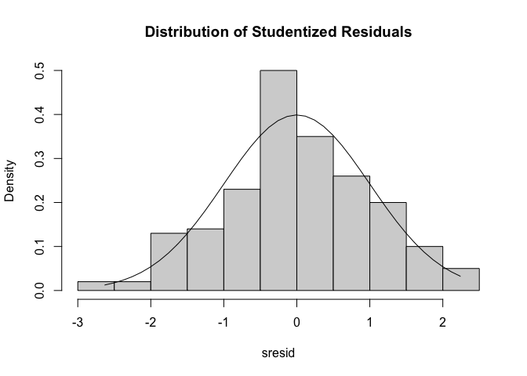
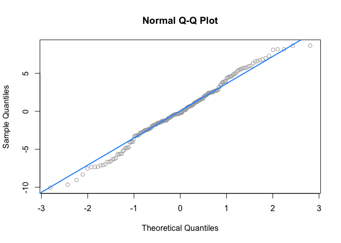
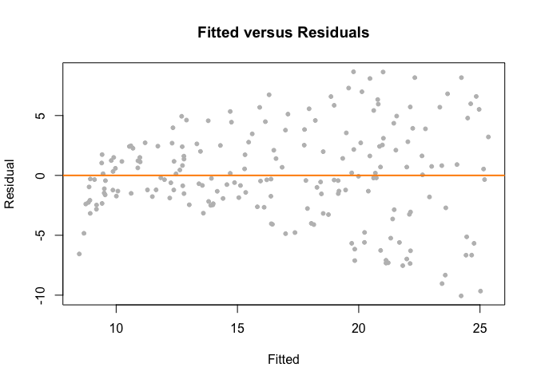

TASK 8: Linear Models I
================
Tamryn Baxter
2022-09-01

-   [R Markdown](#r-markdown)

## R Markdown

``` r
##TASK 8. Linear Models I
##Upload the dataset
MarketData<- read.csv("marketing.csv")
```

``` r
##Check the data types
str(MarketData)
```

    ## 'data.frame':    200 obs. of  4 variables:
    ##  $ youtube  : num  276.1 53.4 20.6 181.8 217 ...
    ##  $ facebook : num  45.4 47.2 55.1 49.6 13 ...
    ##  $ newspaper: num  83 54.1 83.2 70.2 70.1 ...
    ##  $ sales    : num  26.5 12.5 11.2 22.2 15.5 ...

\##The explanatory variable is sales and the response variable is
Youtube

``` r
##Check whether there is a correlation between the two
cor(MarketData$sales, MarketData$facebook)
```

    ## [1] 0.5762226

\#Yes, there is a positive correlation of 0.5762 between sales and
facebook.

``` r
library(lmtest)# for function "bptest" and "dwtest"
```

    ## Loading required package: zoo

    ## 
    ## Attaching package: 'zoo'

    ## The following objects are masked from 'package:base':
    ## 
    ##     as.Date, as.Date.numeric

``` r
library(MASS)# to create the histogram of the residuals
```

``` r
## Run the simple regression model
fit <- lm(sales ~ youtube, data = MarketData)
```

``` r
## summarize the results
summary(fit)
```

    ## 
    ## Call:
    ## lm(formula = sales ~ youtube, data = MarketData)
    ## 
    ## Residuals:
    ##      Min       1Q   Median       3Q      Max 
    ## -10.0632  -2.3454  -0.2295   2.4805   8.6548 
    ## 
    ## Coefficients:
    ##             Estimate Std. Error t value Pr(>|t|)    
    ## (Intercept) 8.439112   0.549412   15.36   <2e-16 ***
    ## youtube     0.047537   0.002691   17.67   <2e-16 ***
    ## ---
    ## Signif. codes:  0 '***' 0.001 '**' 0.01 '*' 0.05 '.' 0.1 ' ' 1
    ## 
    ## Residual standard error: 3.91 on 198 degrees of freedom
    ## Multiple R-squared:  0.6119, Adjusted R-squared:  0.6099 
    ## F-statistic: 312.1 on 1 and 198 DF,  p-value: < 2.2e-16

``` r
##Fit the Linear Regression Model
#Check the assumptions
# histogram of the residuals
sresid <- studres(fit)
hist(sresid, freq=FALSE,
     main="Distribution of Studentized Residuals")
xfit<-seq(min(sresid),max(sresid),length=40)
yfit<-dnorm(xfit)
lines(xfit, yfit)
```

<!-- -->

``` r
#The histogram looks like a bell-curve. Therefore,residuals might be normally distributed 
```

``` r
##QQ-plot of the residuals
qqnorm(resid(fit), col = "darkgrey")
qqline(resid(fit), col = "dodgerblue", lwd = 2)
```

<!-- -->

``` r
 ##Because the vast majority of points on or very near the line, the residuals may be normally distributed.
```

``` r
shapiro.test(resid(fit))
```

    ## 
    ##  Shapiro-Wilk normality test
    ## 
    ## data:  resid(fit)
    ## W = 0.99053, p-value = 0.2133

``` r
##The large p-value (i.e., larger than 0.05) indicates the normality of the residuals.
```

``` r
##homoscedasticity (Non-constant Error Variance)
plot(fitted(fit), resid(fit), col = "grey", pch = 20,
     xlab = "Fitted", ylab = "Residual",
     main = "Fitted versus Residuals")
abline(h = 0, col = "darkorange", lwd = 2)
```

<!-- -->

``` r
#The fitted versus residuals plot looks good. We don’t see any obvious pattern, and the variance looks roughly constant. (Maybe a little larger for large fitted values, but not enough to worry about.)
```

``` r
##Non-independence of residuals using the Durbin-Watson test 
dwtest(fit)
```

    ## 
    ##  Durbin-Watson test
    ## 
    ## data:  fit
    ## DW = 1.9347, p-value = 0.3213
    ## alternative hypothesis: true autocorrelation is greater than 0

``` r
##The large p-value (i.e., larger than 0.05) indicates that residuals are independent
```

\##Which Model describes your data well? Explain. \#The model that
describes the data well is the linear model because it gives the linear
relationship between the two variables in question.
